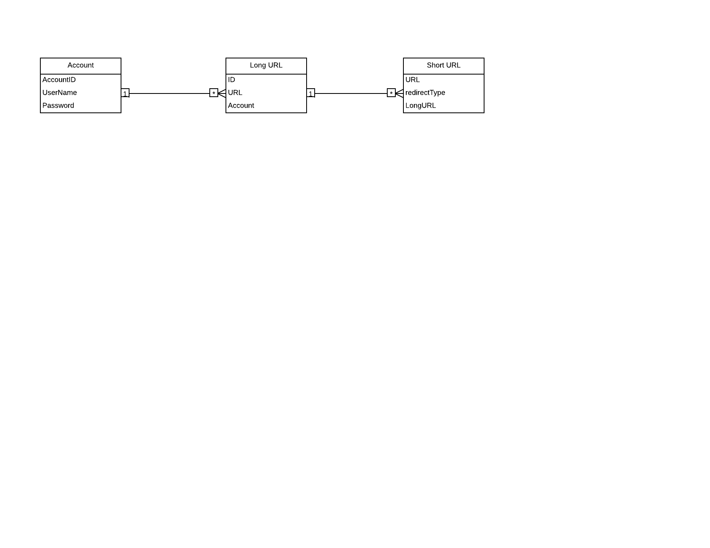

# serviceregistery

This is Gradle Project.

This Application takes the Long URL and return the Short URL, So it will be convineant for User to use Short URL.

Check out the repository using below command

git@github.com:jadh39/serviceregistery.git

Tchnology Used

    Spring Boot
    Spring MVC
    Spring Data JPA
    Gradle
    H2 embedded database
Data Base Schema diagram.

<b>How to Run</b>

go to parent folder of the project and run gradle clean build command it will create the jar file "serviceregistry-0.0.1-

SNAPSHOT.jar" @ build/libs folder

goto /build/libs and run java -jar serviceregistry-0.0.1-SNAPSHOT.jar or got to parent directory and run gradle bootRun command

More information about this application can be found on help page 

http://localhost:8080/help.html

 

 

 
